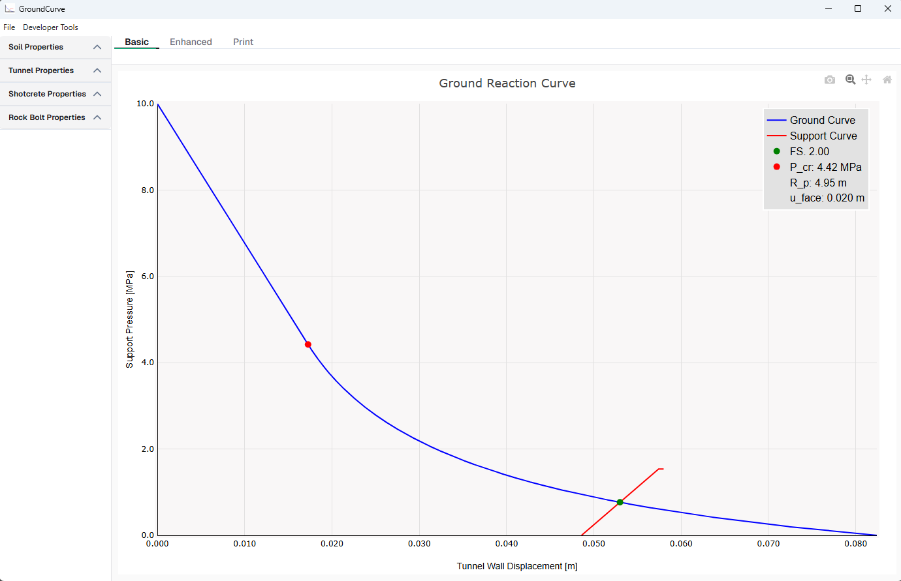
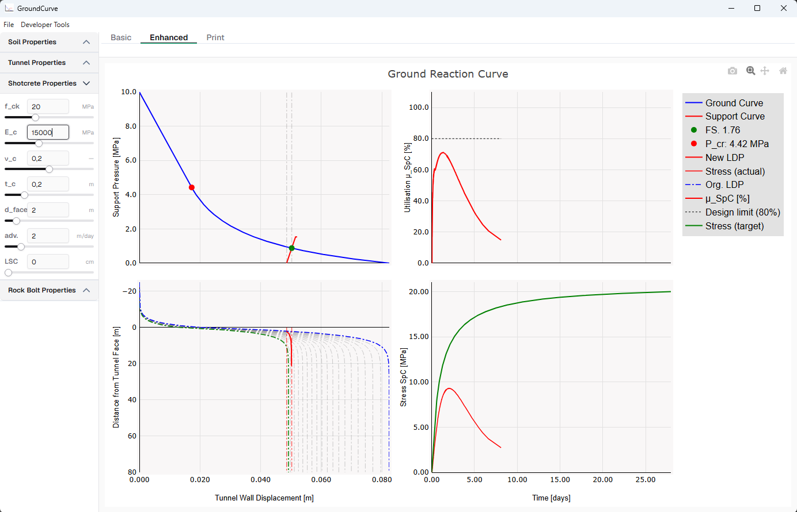
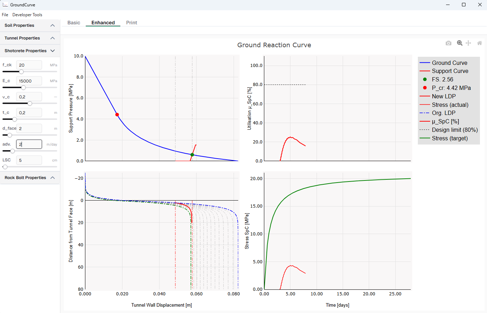

# GroundCurve — Tunnel Ground Reaction Analysis (JavaScript)

A desktop application for analytical pre-design of tunnel support using the **Convergence-Confinement Method (CCM)**. This is the JavaScript/Electron reimplementation of the original Python version.

## ⬇️ Download

**[GroundCurve-win32-x64.zip](https://github.com/onurkoc/ground-curve-JS/releases/download/v1.8.1/GroundCurve-win32-x64.zip)** — Windows x64, no installation required. Extract and run `GroundCurve.exe`.

---

## Screenshots

### Basic Tab — Ground Reaction Curve


### Enhanced Tab — Full CCM Dashboard


### Enhanced Tab — With LSC Yield Element


---

## Features

- **Ground Reaction Curve (GRC)** — Mohr-Coulomb elasto-plastic solution (Hoek formulation) with large-strain correction (Vrakas & Anagnostou)
- **Longitudinal Displacement Profile (LDP)** — Vlachopoulos & Diederichs (2005)
- **Support Characteristic Curve (SCC)** — Thick-walled cylinder shotcrete + rock bolt stiffness
- **LSC (Lining Stress Controller) support** — Yield gap modelled correctly: zero shotcrete stress until gap is exhausted
- **Rate-of-Flow stress model** — Time-dependent shotcrete stress accounting for creep, shrinkage and thermal effects (Entfellner 2020)
- **Shotcrete utilisation μ_SpC(t)** — σ_actual(t) / σ_capacity(t) × 100 %, with 80 % design limit (γ_F = 1/1.35)
- **Lining forces N & M** — Möller & Vermeer (2005), scaled by displacement ratio
- **Safety factor FS** — at GRC ∩ SCC equilibrium
- **Print tab** — parameter summary window

---

## Tech Stack

| Layer | Library |
|---|---|
| Desktop shell | Electron 42 |
| UI framework | Vue 3 + PrimeVue 4 (Aura theme) |
| Charts | Plotly.js (cartesian bundle) |
| Build | electron-vite + Vite 5 |
| Font | Geist |

---

## Installation

```bash
npm install
```

> On first install, Electron's binary download may need to be triggered manually if the postinstall script fails:
> ```bash
> node node_modules/electron/install.js
> ```

## Development

```bash
npm start
```

## Package (Windows)

```bash
npm run package-win
```

Output: `release-builds/GroundCurve-win32-x64/GroundCurve.exe`

---

## Physics References

| Method | Reference |
|---|---|
| CCM (GRC) | Hoek, E. (2007). *Practical Rock Engineering* |
| Large-strain correction | Vrakas, A. & Anagnostou, G. (2014). *Géotechnique* |
| LDP | Vlachopoulos, N. & Diederichs, M.S. (2005). *Rock Mechanics and Rock Engineering* |
| Lining forces | Möller, S.C. & Vermeer, P.A. (2005). Proc. *5th Int. Symp. on Sprayed Concrete* |
| Shotcrete strength (time) | Aldrian, W. (1991). *Beitrag zum Materialverhalten von früh belastetem Spritzbeton* |
| Rate-of-Flow / LSC / utilisation | Entfellner, M. (2020). *Doctoral thesis, TU Graz* |

---

## Credits

Special thanks to:

- **Nedim Radoncic** — for collaboration and scientific input on the shotcrete mechanics implementation
- **Manuel Entfellner** — for the Rate-of-Flow methodology, LSC modelling, and shotcrete utilisation framework documented in his doctoral thesis *(TU Graz, 2020)*

---

## License

[MIT](LICENSE) — © 2025 Onur Koc
